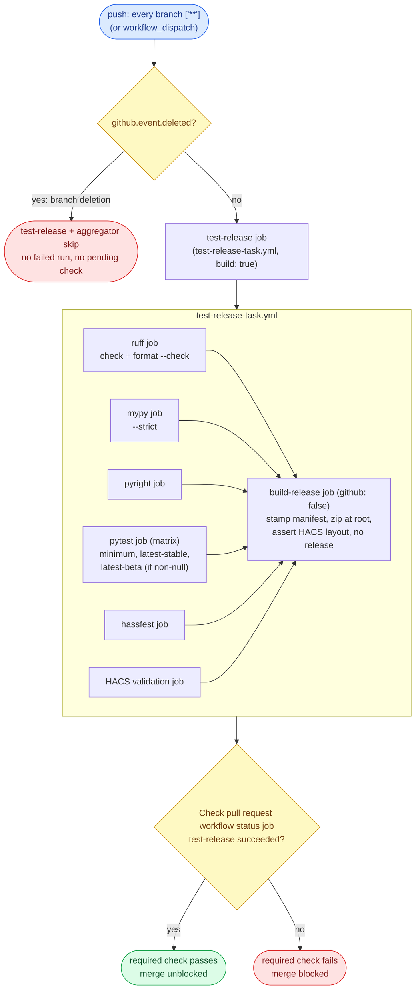
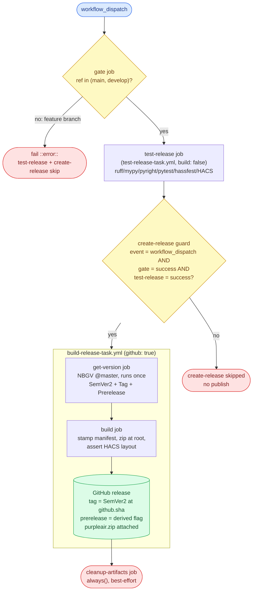
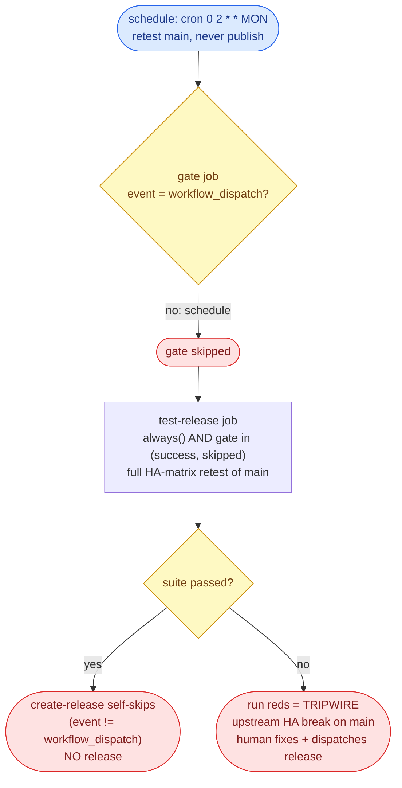
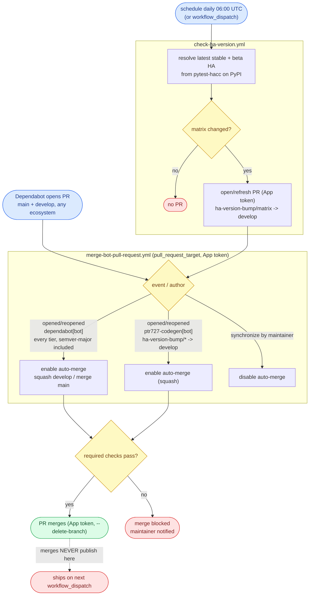

# WORKFLOW.md

The single guide for this repo's CI/CD **workflows** (GitHub Actions): **code style**, **architecture**, a
**behavioral contract** (expected inputs and outputs), and a **test methodology**. Source style lives in
[`CODESTYLE.md`](./CODESTYLE.md). This file covers everything under
[`.github/workflows/`](./.github/workflows/).

It **describes required outcomes, not a required implementation.** A workflow is correct when it satisfies
the contract (section 4), whatever shape its YAML takes. Section 2 keeps workflows legible. Section 3 is
the model. Section 4 is what they must *do*. Sections 5 and 6 are how to verify it and the configuration it
assumes. Each guarantee names the **failure it prevents**, so the reason survives a reimplementation.

## 0. The model at a glance

homeassistant-purpleair ships **one target**: a **Home Assistant custom integration** distributed through
[HACS](https://hacs.xyz/) as a zip release. The integration's Python lives in
[`custom_components/purpleair/`](./custom_components/purpleair/); there is no compiled artifact. HACS is a
**pull** distributor - it installs from a GitHub Release asset - so releasing is **dispatch-only**: a
maintainer ships on demand, and ordinary merges never publish. Two workflows do the publishing work, plus a
daily tracker that keeps the test matrix current:

- **CI** ([`test-pull-request.yml`](./.github/workflows/test-pull-request.yml)) runs on **push to every
  branch**: it validates (lint, type-check, the HA-version test matrix) and proves the release zip builds,
  publishing nothing. A pull request merges only when its required check is green.
- **The publisher** ([`publish-release.yml`](./.github/workflows/publish-release.yml)) is **dispatch-only**,
  plus a **retest-only weekly schedule**. A `workflow_dispatch` from `main` cuts a **stable** release (clean
  NBGV `X.Y.Z`); a dispatch from `develop` cuts a **prerelease** (`X.Y.Z-g<sha>`). The **weekly schedule**
  re-runs the full test suite against the live HA matrix and **never publishes** - it is the main-side drift
  alarm complementing the tracker. There is **no `push` trigger**: a merge to `main` or `develop` never cuts
  a release.
- **The HA-version tracker** ([`check-ha-version.yml`](./.github/workflows/check-ha-version.yml)) runs
  **daily**: it resolves the latest stable and beta Home Assistant versions from
  `pytest-homeassistant-custom-component` on PyPI and records them in `.github/ha-test-versions.json` via an
  App-signed, auto-merged bump PR to `develop`. It **retests**, it does **not** publish - a breaking HA
  release reds the bot PR's CI for a human to fix.

There is no publish-on-merge, no per-push release, and no two-branch matrix - one run builds, versions, and
publishes exactly its own trigger ref. Dependabot pull requests merge themselves once their checks pass.

### Glossary

- **Entry workflow** - has `push` / `schedule` / `workflow_dispatch` / `pull_request_target` triggers. The
  orchestrator that an event or a person starts.
- **Reusable workflow (task)** - a `workflow_call` workflow invoked through a `uses:` reference, never
  triggered directly. File ends in `-task.yml`.
- **Target** - the one shipped output: the **HACS zip** `purpleair.zip`, produced by
  [`build-release-task.yml`](./.github/workflows/build-release-task.yml) and attached to a GitHub Release.
- **Validate task** - [`test-release-task.yml`](./.github/workflows/test-release-task.yml): ruff, mypy
  `--strict`, pyright, the HA-version pytest matrix (Codecov upload), hassfest, HACS validate, and a
  no-publish build of the release zip. The Python analog of a validate-plus-smoke pair. CI runs it on every
  push; the publisher runs the identical task before any release.
- **No-publish build** - a build of `purpleair.zip` that proves the release pipeline still produces a valid
  HACS zip, uploading the artifact for the run but creating no release. Driven by `build-release-task`'s
  `github: false` input (and `test-release-task`'s `build` input, which selects whether that no-publish
  build runs).
- **HACS zip** - `purpleair.zip` with the integration's files **at the archive root** (`manifest.json`,
  `__init__.py`, ...), no `purpleair/` wrapper - the layout HACS requires when `hacs.json` sets
  `zip_release: true` + `filename`, since HACS extracts the asset directly into
  `<config>/custom_components/<domain>/`. The build asserts this layout and fails on a regression.
- **Transfer artifact** - a workflow artifact handing a file between jobs of one run (here, `purpleair-zip`
  passed from the build job to the release job). The durable copy lives on the GitHub release.
- **Shipped version** - NBGV's `SemVer2`, computed from `version.json` (`1.0` floor) plus git height. It is
  stamped into `manifest.json` at build time and used as the release tag. Independent of the integration's
  own dependency pins (`ptr727-aiopurpleair`) and the HA test-matrix versions.
- **GitHub App token** - a short-lived installation token from `actions/create-github-app-token`, minted
  from the App credentials (`CODEGEN_APP_CLIENT_ID` / `CODEGEN_APP_PRIVATE_KEY`). The merge-bot and the
  tracker use it, not `GITHUB_TOKEN`: a `GITHUB_TOKEN` push does not trigger downstream workflows, and that
  token is read-only on Dependabot pull requests.

## 1. Purpose and how to use this document

- **Contract, not implementation.** Conform to the *outcomes* in section 4 and the *architecture* in section
  3. Job names and file layout may vary; the input/output behavior may not.
- **"Operational" - the one definition.** The repo is **operational** when every applicable section-4
  guarantee holds, every applicable section-5B scenario's observed output equals its expected output
  (corroborated by a 5C live probe where a live signal exists), and the section-6 configuration is in place.
  Anything else is **not operational**.
- **Defect vs N/A.** An item is **N/A** only when this repo has no such concern (e.g. a fork-PR scenario,
  since a fork cannot push here; or a NuGet/Docker publish, since this repo ships a HACS zip). A construct
  required by an applicable guarantee but absent is a **defect**.
- **Default branch is `main`.** Guarantees say "default branch" portably. This repo writes the literal
  `main` in the dispatch gate and the `prerelease` derivation (via `github.ref`), and the anchored
  `^refs/heads/main$` in `version.json`'s `publicReleaseRefSpec`.
- **The verbs.** **Audit** (static 5A, configuration 5D), **Test** (trace, 5B), **Assess** (verdict).

## 2. Workflow style conventions

Legibility rules. Necessary but not sufficient: a perfectly styled workflow can still violate section 4.

- **Action pinning.** Pin every action to a commit SHA with a trailing `# vX.Y.Z` comment. Use `# vX` only
  when the upstream floating major tag has no specific patch SHA. The **sole exception is
  `dotnet/nbgv@master`** (see D9.1). Actions that float a vendor `@master` ref by design
  (`home-assistant/actions/hassfest@<sha> # master`) stay SHA-pinned with the `master` provenance noted in
  the comment.
- **Filename.** Reusable workflows end in `-task.yml`; entry workflows end in what they do
  (`-pull-request.yml`, `-release.yml`, `check-ha-version.yml`). A `-task.yml` is `uses:`-d, never triggered
  directly.
- **Workflow `name:`.** Reusable names end in **"task"**, entry names in **"action"**.
- **Job and step `name:`.** Every job `name:` ends in **"job"**, every step `name:` in **"step"**, the
  aggregator included (`Check pull request workflow status job`). A job name also bound as a ruleset
  required-check `context:` is codified in [`repo-config/`](./repo-config/) and changed only **in lockstep**
  with the live ruleset.
- **Concurrency.** Every entry workflow declares a `concurrency` group. CI and the tracker use
  `group: '${{ github.workflow }}-${{ github.ref }}'` (the tracker omits the ref, keying on the workflow
  alone since it has one rolling branch) with `cancel-in-progress: true`. The **publisher** overrides it: a
  ref-independent group (`group: ${{ github.workflow }}`) with `cancel-in-progress: false`, so a
  main-dispatch stable release and a develop-dispatch prerelease never run concurrently against the same
  Releases repo and none is cancelled mid-release (which could leave a half-created release). The
  **merge-bot** keys on the PR number with `cancel-in-progress: false`.
- **Shells.** Every multi-line bash `run:` starts with `set -euo pipefail`.
- **Conditionals.** Multi-line `if:` uses the folded scalar `if: >-`.
- **Boolean inputs.** A boolean used by both `workflow_call` and `workflow_dispatch` is declared in both
  trigger blocks and compared against `true` and `'true'` (`workflow_dispatch` delivers the string).
- **Reusable-workflow permissions.** Job-level `permissions:` are validated before `if:`, so even a skipped
  job needs valid permissions. Grant least privilege; a callee's extra scope (e.g. `contents: write` to
  create the release, `actions: write` to delete artifacts) is granted by the caller at the `uses:` job.
- **Allowlist `success` and `skipped` explicitly** across an optional dependency: use
  `(needs.X.result == 'success' || needs.X.result == 'skipped')`, not `!= 'failure'`. A job that must run
  when an upstream `needs:` was *skipped* (the scheduled retest, whose `gate` is dispatch-only) wraps its
  `if:` in `always() &&` so GitHub's skipped-dependency auto-skip does not suppress it.
- **Line endings.** Workflow YAML and JSON follow [`.editorconfig`](./.editorconfig) (CRLF). Preserve on
  every edit.

## 3. Architecture

### Two workflows: CI on push, publishing on dispatch

CI ([`test-pull-request.yml`](./.github/workflows/test-pull-request.yml)) and the publisher
([`publish-release.yml`](./.github/workflows/publish-release.yml)) are separate workflows with separate
concurrency, so they never race. CI re-tests every pushed tree and never publishes; the publisher releases
only on a maintainer's dispatch (and retests, never publishes, on its weekly schedule). *Prevents a merge
from silently cutting a release, and a CI run from racing a publish on the same ref.*

### The publisher is dispatch-only; the schedule retests and stops

A publish happens **only** on `workflow_dispatch`. The publisher's `gate` job asserts the dispatch ref is
`main` or `develop` and fails loudly otherwise; the trigger ref alone decides the version class (`main` ->
stable clean SemVer, `develop` -> prerelease `-g<sha>`, classified natively by NBGV from `github.ref`). The
single `create-release` job is gated `github.event_name == 'workflow_dispatch'`, so the **weekly schedule
never publishes**: on the schedule the `gate` job is skipped, the `test-release` job runs anyway (its
`always() && (gate == success || gate == skipped)` guard), and `create-release` self-skips. The schedule's
job is to retest the shipped `main` against the live HA matrix so upstream HA drift that breaks the released
integration reds a run a maintainer can see. *Prevents per-merge release churn, a blind scheduled republish,
and a develop tip dispatched as stable.*

### Versioning: compute once, thread everywhere

NBGV runs in exactly **one** job ([`get-version-task.yml`](./.github/workflows/get-version-task.yml)),
classifying from `github.ref` on a real-branch-tip checkout, and emits `SemVer2`, `Tag`, and a derived
`Prerelease` flag. Those thread to every consumer via `outputs:` / `needs:`; no other job re-invokes NBGV
(`build-release-task` calls `get-version-task` once and reads its outputs in both the build and release
jobs). `main` (the public ref, `publicReleaseRefSpec = ^refs/heads/main$`) builds a clean `X.Y.Z`; every
other branch a prerelease `X.Y.Z-g<sha>`. *Keeps the stamped `manifest.json` version and the release tag in
agreement.* NBGV needs only `version.json` (floor `1.0`) and git height, so it works although the repo
builds no .NET assembly. The `Prerelease` flag is derived by testing `SemVer2` for any `-` segment (not from
NBGV's `PrereleaseVersion`, which carries only an explicit `-tag` from `version.json`), so a dispatch from
the wrong branch stays honest about its prerelease status.

### Validate at entry, then build the zip

`build-release-task` versions once, then in the `build` job stamps `manifest.json` with the NBGV `SemVer2`
(the checked-in placeholder is `0.0.0`; the rewrite is on the runner only, no commit), zips
`custom_components/purpleair/` **at the archive root**, and **asserts the layout** (`manifest.json` +
`__init__.py` present at root, no `purpleair/` wrapper) before uploading - failing the build on a HACS
double-nesting regression rather than shipping a broken install. The `release` job runs only when
`inputs.github` is true.

### Fast CI feedback, head-resolved

CI runs on push to every branch (`push: ['**']`), so GitHub head-resolves the reusable `./...` workflows
from the pushed head: a pull request that edits a reusable task tests its own copy. CI calls
`test-release-task` (the full validate suite, including a `build: true` no-publish build of the zip). One
aggregator job, `Check pull request workflow status job`, is the ruleset-bound required check and gates the
merge; it `needs:` `test-release` and fails on any non-success. A branch-deletion push (all-zeros
`github.sha`) is skipped by a `!github.event.deleted` guard on both jobs, so a deletion never runs a failing
build or leaves the required check pending. The publisher runs the **same** `test-release-task` definition
before any release, so the CI gate and the publish gate are identical.

### The validate suite

`test-release-task` holds the Python analog of a validate-plus-smoke pair:

- **ruff** (`ruff check` + `ruff format --check`), **mypy** (`--strict`, Platinum quality-scale
  strict-typing), **pyright** (the engine behind Pylance, config in `pyrightconfig.json`).
- **pytest matrix** over the HA versions in `.github/ha-test-versions.json`: `minimum` (hand-maintained,
  must match `hacs.json`'s `homeassistant`), `latest-stable`, and `latest-beta` (bot-maintained; the beta
  slot is omitted when null). Each leg installs the slot's `homeassistant==` and
  `pytest-homeassistant-custom-component==` pins and uploads coverage to Codecov, flagged per slot. All
  three slots gate equally.
- **hassfest** (`home-assistant/actions/hassfest`) and **HACS validate** (`hacs/action`, integration
  category) - the publish-validation checks the HACS / HA ecosystems require.
- the **no-publish build** of `purpleair.zip` (`build-release-task` with `github: false`), gated on every
  upstream check, run on CI's `build: true` and skipped on the publisher's `build: false` so the release
  zip is built once for real by `create-release`.

### Resource lifecycle

The build job's `purpleair-zip` is an intra-run transfer artifact; the durable copy is the GitHub release
asset. The build's `upload-artifact` sets `retention-days: 1` as a backstop, and the publisher's
`cleanup-artifacts` job (`always()`, `continue-on-error: true`) deletes the run's artifacts after
`create-release` has consumed them. *(This repo's cleanup currently enumerates and deletes the run's whole
artifact set rather than the single transfer artifact by name; with one short-lived transfer artifact and a
`retention-days: 1` backstop the practical effect is the same. See D5.)*

### Self-testing workflows, and the required-context invariant

A pull request exercises its own workflow files. No change waits to reach `main` first.

- **CI runs on `push` to every branch.** GitHub head-resolves the reusable `./...` workflows from the pushed
  head, so a PR that edits a reusable task tests its own copy. The push run is the **sole producer** of the
  aggregator's ruleset-bound `context:`, on the head SHA branch protection evaluates. CI never publishes.
- **Dependabot and tracker PRs are in-repo branches**, validated head-resolved by their push the same way
  (Dependabot with a read-only token and the Dependabot secret store, enough for the gate).
- **A dispatched publish uses that branch's workflows**, so a workflow change is usable on the branch that
  introduces it.
- **Forks are the documented exception.** A fork cannot push here, so its PR produces no run and no
  aggregator check, and a maintainer lands the change on an in-repo branch before merging. See D6.

### Self-sufficiency: automatic updates and HA-version tracking

- **Dependabot pull requests merge themselves** once the required checks pass - every tier, **semver-major**
  included: the required checks are the gate, not the version bump. Dependabot is **dual-target** (`main` **and**
  `develop`) so both branches stay current and never drift apart; a `develop` bump is sync-only and never
  publishes (merges do not publish here), and a `main` bump likewise ships only when a maintainer next
  dispatches a release. A merged bump does **not** itself publish.
- **The HA-version tracker** ([`check-ha-version.yml`](./.github/workflows/check-ha-version.yml)) runs daily,
  resolves the latest stable and beta HA from `pytest-homeassistant-custom-component` on PyPI, and opens
  **one** bundled rolling PR (`ha-version-bump/matrix`) to `develop` via the App, rewriting
  `.github/ha-test-versions.json`. The merge-bot's `merge-ha-version-bump` job auto-merges it on green. It
  **retests** (a breaking HA release reds the bot PR's CI for a human), it does **not** publish. The
  publisher's weekly schedule is the main-side complement, retesting the shipped `main` against the live
  matrix.

This repo has **no codegen** (no generated source) and **no NuGet/Docker** target. A person steps in only
for a breaking change (a red check) or to dispatch a release.

### The single-target release

The repo produces exactly one shipped artifact, the HACS zip. `create-release` (in `build-release-task`,
`github: true`) downloads `purpleair-zip` and `softprops/action-gh-release` creates the tag + release with
auto-generated notes, attaching `purpleair.zip` (`fail_on_unmatched_files: true` - the asset must exist).
`target_commitish` is set explicitly to `github.sha` so the tag lands on the built commit (the develop or
main tip dispatched), not the API's default of the repository default branch. The GitHub-release
`prerelease` boolean is NBGV's derived `Prerelease`. There is no NuGet push, no Docker push, no OIDC - the
release is keyless and GitHub-native.

### Flow diagrams

Four diagrams trace the architecture above: the pull-request gate, the dispatch-only publisher, the
weekly retest tripwire, and the bot automation. They depict the same outcomes that the section 4 contract specifies, drawn
from the workflow YAML; if a diagram and a guarantee disagree, one of them is a defect. Triggers are
blue, gates yellow, durable/published outputs green, and stop/skip outcomes red.

**Pull request (CI) - `test-pull-request.yml`.** Every push head-resolves the reusable validate task
(ruff, mypy, pyright, the HA-version pytest matrix, hassfest, HACS, and a no-publish zip build), and a
single aggregator produces the ruleset-bound required check (D1, D6).

**Publish (dispatch-only) - `publish-release.yml` -> `build-release-task.yml`.** ONLY a
`workflow_dispatch` reaches `create-release`. The `gate` job restricts the dispatch ref to `main` or
`develop`, the validate task gates it, NBGV versions once, and the GitHub release is cut with
`purpleair.zip` attached (D2, D3, D4).

**Weekly retest tripwire - `publish-release.yml` on `schedule`.** The Monday cron retests the shipped
`main` against the live HA matrix and NEVER publishes: `gate` is dispatch-gated so it skips, the
`always()` guard lets `test-release` run anyway, and `create-release` self-skips. A red run flags an
upstream Home Assistant break for a human to fix and release manually (D4.1, D4.5).

**Automation - Dependabot + HA-version tracker + merge-bot.** Daily the tracker resolves the latest HA
pins and opens a rolling bundled PR; Dependabot opens its own PRs; the merge-bot enables auto-merge (or
disables it on a maintainer push). A merged change NEVER publishes here - it ships on the next dispatch
(D8).

## 4. Behavioral contract - expected outcomes

Each is a **MUST**, stated as input -> output plus the failure it prevents.

### D0 - Architecture

- **D0.1 CI is one run, one branch.** Input: any push. Output: `test-pull-request` validates exactly
  `github.ref_name` and publishes nothing. *Prevents cross-branch ref mixing in CI.*
- **D0.2 The publisher builds one branch: the dispatch ref.** Output: the `gate` job restricts dispatch to
  `main`/`develop`, and the run versions/builds/tags exactly `github.ref_name`. No matrix, no `branch`
  input that can disagree with the ref. *Prevents cross-branch ref mixing - `github.ref` is the branch being
  published.*
- **D0.3 One version, threaded.** Output: NBGV runs once (`get-version-task`); every consumer reads it via
  `needs:` outputs (the build and release jobs both read the single `get-version` job). No consumer
  recomputes it. *Prevents the stamped version diverging from the tag, and a second NBGV run reclassifying
  it.*

### D1 - CI fast feedback

- **D1.1 Every push validates.** Output: on any push, `test-pull-request` calls `test-release-task` (ruff,
  mypy, pyright, the pytest matrix, hassfest, HACS, and a `build: true` no-publish zip build), with no paths
  filter. The one exception is a branch-deletion push: a `!github.event.deleted` guard skips both jobs (and
  the aggregator), since `github.sha` is all-zeros and a checkout would fail. *Prevents a reusable-workflow
  or build break shipping untested; a branch-deletion push failing CI.*
- **D1.2 The full quality gate runs.** Output: `test-release-task` runs ruff (lint + format check), mypy
  `--strict`, pyright, the HA-version pytest matrix (`minimum`, `latest-stable`, and `latest-beta` when
  non-null - all gate equally), hassfest, and HACS validate. A failure on any one reds the suite.
- **D1.3 Lint and type-checks are enforced in CI.** Output: ruff, mypy, and pyright run in CI from the same
  config files the editor uses (`pyrightconfig.json`, project ruff/mypy config), so a style or typing defect
  cannot reach the branch on editor-faith. *(There is no CSharpier/`dotnet format`; this is Python.)*
- **D1.4 The no-publish build never publishes.** Output: `build-release-task` with `github: false` builds
  and asserts the zip layout but creates no release (the `release` job is gated `if: inputs.github`).
  *Prevents a CI run publishing.*
- **D1.5 One required aggregator gates merge.** Output: a single aggregator job
  (`Check pull request workflow status job`) must **succeed** (not merely "not fail"), `needs:`
  `test-release`, and blocks on any non-success. Its name is ruleset-bound (D6.2) and must not be renamed.
  *Prevents a defect merging unverified.*

### D2 - Validation at entry

- **D2.1 Gate the dispatch before publishing.** Output: the publisher's `gate` job asserts the dispatch ref
  is `main` or `develop` and fails fast with `::error::` before any build; `test-release` and
  `create-release` are gated on it. *Prevents a stray dispatch from a feature branch publishing.*
- **D2.2 Branch matches version classification.** Output: the `Prerelease` flag is derived from `SemVer2`'s
  `-` segment, so a `develop` build is always prerelease and a `main` build always stable, independent of
  any explicit flag. NBGV's `publicReleaseRefSpec = ^refs/heads/main$` and the dispatch gate together keep
  `main` clean and every other branch suffixed. *Prevents a develop build published as stable.*

### D3 - Versioning and classification

- **D3.1 NBGV runs once, threaded.** Output: NBGV runs once in `get-version-task`, classifying from
  `github.ref`; no consumer re-invokes it. *Prevents a leg classified by the wrong ref; a version diverging
  from the tag.*
- **D3.2 `main` = stable, others = prerelease.** Output: `main` -> `X.Y.Z` (`Prerelease=false`), any other
  branch -> `X.Y.Z-g<sha>` (`Prerelease=true`). `publicReleaseRefSpec` is `^refs/heads/main$`; the GitHub
  release `prerelease` boolean is the derived `Prerelease`.
- **D3.3 Version floor + git height.** Output: `version.json` sets the major.minor floor (`1.0`), NBGV
  appends the git height as the patch, never bumped on a cadence. The NBGV version is stamped into
  `manifest.json` and drives the release tag; it is independent of the integration's `requirements` pins and
  the HA test-matrix versions. *(Who raises the floor and when is a human-process rule in `AGENTS.md`.)*

### D4 - Release / publish

- **D4.1 Publish only by dispatch - never on a merge or a schedule.** Output: `publish-release` triggers are
  `workflow_dispatch` and a weekly `schedule` only - there is **no `push` trigger** and no
  `PUBLISH_ON_MERGE`. The `create-release` job is gated `github.event_name == 'workflow_dispatch'`, so the
  schedule **retests and stops**. *Prevents per-merge release churn and a blind scheduled republish; HACS is
  a pull model, so the maintainer ships on demand.*
- **D4.2 Publish exactly the dispatch branch.** Output: a dispatch publishes only `github.ref_name` -
  `main` -> stable, `develop` -> prerelease - gated by the `gate` job to `main`/`develop`. *Prevents
  publishing the wrong branch.*
- **D4.3 Tag the built commit.** Output: the release `target_commitish` is set explicitly to `github.sha`
  (the dispatched tip), never the API's default of the repository default branch. *Prevents a develop
  release's tag landing on main's tip.*
- **D4.4 Release contents and flag.** Output: every release is a tag on the built commit plus auto-generated
  notes, with `purpleair.zip` attached (`fail_on_unmatched_files: true` - the HACS asset must exist; this
  repo *does* attach a build asset, unlike a Docker-only sibling). The zip carries the integration's files
  at the archive root (HACS layout, asserted at build). The GitHub-release `prerelease` boolean is the
  derived NBGV `Prerelease`.
- **D4.5 No publish on the retest schedule.** Output: a weekly scheduled run executes the full validate
  suite against `main` and creates **no** release (`create-release` is dispatch-only). *Prevents a duplicate
  or unintended scheduled release while still surfacing upstream HA drift.* *(There is no version-unchanged
  re-dispatch dedup: a dispatch re-creating an existing tag is a maintainer action, and the schedule never
  reaches `create-release`.)*
- **D4.6 Publish is tested as built.** Output: the publisher runs the same `test-release-task` (the D1.2
  suite) as a `test-release` job, and `create-release` requires `needs.test-release.result == 'success'` -
  never `skipped`/`failure`/`cancelled` - so a regressed tip cannot ship. It is the identical definition CI
  runs. *Prevents publishing a tree that would fail the PR gate.*
- **D4.7 Publishing is keyless and GitHub-native.** Output: the release is created by
  `softprops/action-gh-release` with the run's `contents: write` token; there is **no** NuGet/OIDC or Docker
  Hub credential. HACS reads the public GitHub Release asset, so no external publish key exists. *Prevents a
  leaked publish credential (there is none to leak).*

### D5 - Resource cleanup

- **D5.1 The transfer artifact is reclaimed.** Output: the build's `purpleair-zip` upload sets
  `retention-days: 1`, and the publisher's `cleanup-artifacts` job (`always()`, `continue-on-error: true`)
  deletes the run's artifacts after `create-release` consumes them. *Prevents transfer artifacts
  accumulating against the storage quota.*
- **D5.2 Cleanup never reds a run.** Output: `cleanup-artifacts` is `continue-on-error: true`, tolerates a
  failed listing, and is independent of any required check, so a housekeeping hiccup never reds a successful
  publish or gates a merge. *Known divergence from the canonical contract: this cleanup enumerates and
  deletes the run's whole artifact set (`.artifacts[].id`) rather than the single transfer artifact by name.
  With exactly one short-lived transfer artifact and the `retention-days: 1` backstop the effect is benign,
  but a future second artifact would want a name-scoped delete to preserve any diagnostic artifact.*

### D6 - Self-testing workflows

- **D6.1 A change is testable on its own branch.** Output: a workflow or build change is exercised by CI on
  the branch that introduces it, no dependency on reaching `main` first. *Prevents the "promote to `main` to
  test the fix" trap.*
- **D6.2 Head-resolution, single producer, fork exception.** Output: CI runs on `push` to every branch so
  reusable `./...` logic resolves from the head, and the aggregator's ruleset-bound `context:` is produced
  by that push run as the sole producer of that name. Dependabot and tracker PRs are in-repo branches,
  validated the same way. A fork cannot push, so it has no run and is validated by maintainer action - the
  one exception. *Prevents a dual-producer context race and a false self-test claim for forks.*

### D7 - Concurrency, permissions, safety

- **D7.1 The publisher does not cancel mid-flight.** Output: the publisher uses a ref-independent group
  (`group: ${{ github.workflow }}`) with `cancel-in-progress: false`, so a stable and a prerelease publish
  serialize. CI and the tracker use a `...github.ref`/workflow group with `cancel-in-progress: true`; the
  merge-bot keys on the PR number with `cancel-in-progress: false`.
- **D7.2 Skipped jobs still need valid permissions.** Output: every reusable job runs under valid least-privilege
  `permissions:`; a callee's extra scope (`contents: write` for the release, `actions: write` for cleanup)
  is granted by the caller.
- **D7.3 Boolean inputs both forms.** Output: the `build` input is declared in both `workflow_call` and
  `workflow_dispatch` and compared against `true` and `'true'`.
- **D7.4 Optional-dependency chaining.** Output: a job downstream of an optional dependency allowlists
  `success`/`skipped` explicitly; the scheduled retest wraps its `if:` in `always() &&` so a skipped `gate`
  does not auto-skip it.

### D8 - Bots and automation

- **D8.1 Merge-bot.** Output: runs on `pull_request_target`, holds the App token, merges the PR by URL
  without checking out its code, with `--delete-branch`. Enables auto-merge on `opened`/`reopened`; squash
  on `develop`, merge-commit on `main` by the PR's base ref; disables auto-merge when a maintainer pushes to
  a bot branch (`synchronize`, actor != bot). Concurrency keyed on the PR number. *Prevents two PRs
  colliding in auto-merge; a bot merge that fails to trigger downstream workflows.*
- **D8.2 Dependabot auto-merges on green - every tier, dual-target.** Output: every Dependabot PR
  auto-merges once the required checks pass, **semver-major included**: the required checks are the gate,
  not the version bump. Dependabot is configured for **both** `main` and `develop` (drift-avoidance); a
  merged bump does **not** itself publish (merges never publish here) - a `develop` bump is sync-only, a
  `main` bump ships on the next dispatch. *Prevents a safe update stalling on a human, and cross-branch
  drift; the required checks gate every tier equally, so a bump that breaks a covered path reds CI and stays
  open instead of merging.*
- **D8.3 HA-version tracker.** Output: the tracker runs daily (and on dispatch), resolves the latest stable
  and beta HA from `pytest-homeassistant-custom-component` on PyPI, and opens **one** bundled App-signed
  rolling PR (`ha-version-bump/matrix`) to `develop` rewriting `.github/ha-test-versions.json`; the
  merge-bot's `merge-ha-version-bump` job auto-merges it on green. It **retests** (a breaking HA release
  reds the bot PR's CI), it does **not** publish; the publisher's weekly schedule retests the main side.
  This repo has a tracker but no codegen. *Prevents a new HA release silently breaking the integration
  unnoticed.*

### D9 - Style, static, and dropped workflows (see section 2)

- **D9.1** Every action SHA-pinned with a version comment, **sole exception `dotnet/nbgv@master`**: its tag
  stream lags `master`, so Dependabot tag-tracking would only propose downgrades to stale tags. The
  rationale is documented inline in [`get-version-task.yml`](./.github/workflows/get-version-task.yml).
  (`home-assistant/actions/hassfest` is SHA-pinned with `# master` noting its floating provenance, not an
  exception to pinning.)
- **D9.2** File/workflow/job/step names follow the suffix rules; a ruleset-bound `context:` name moves only
  in lockstep with `repo-config/`.
- **D9.3** Bash `run:` blocks start `set -euo pipefail`; multi-line `if:` uses `>-`.
- **D9.4** Line endings follow `.editorconfig` (CRLF); `.github/ha-test-versions.json` is written with
  `ensure_ascii=False` to preserve its non-ASCII `$comment` without a noisy diff.
- **D9.5 No decorative / dropped workflows.** No date-badge, no codegen, no NuGet/Docker task, no
  `PUBLISH_ON_MERGE` variable, no broad `push` publish trigger. The `check-ha-version` tracker and the
  merge-bot's `merge-ha-version-bump` job are **kept** - this repo uses them.
- **D9.6** Lint/type-checks are enforced in CI (D1.3), from the same config files the editor uses.

### D10 - Repository configuration

- **D10.1 Required configuration is present.** Output: the secrets, branch rulesets, and repository settings
  section 6 lists are all in place. *Prevents a green-looking repo whose first real publish or auto-merge
  fails on a missing secret, an unenforced ruleset, or a disabled setting.* The detail and validation are in
  section 6; the audit is the **5D configuration audit**.

## 5. Test methodology

An agent verifies the repo in escalating modes, then renders the section-1 verdict. Skip N/A items; a
required-but-missing construct is a FAIL.

### 5A. Static audit (no execution)

Read the workflow files plus `version.json`, `hacs.json`, `manifest.json`, and `ha-test-versions.json` and
assert the fact behind each applicable guarantee with a `file:line` citation:

- **D0:** CI has no branch matrix; the publisher's `gate` restricts dispatch to `main`/`develop`; NBGV
  invoked once in `get-version-task`, every consumer reading it via `needs:` (no nested `get-version`).
- **D1:** CI runs on `push: ['**']` with no paths filter; both jobs carry the `!github.event.deleted` guard;
  `test-release-task` runs ruff/mypy/pyright/pytest-matrix/hassfest/HACS plus the `build: true` no-publish
  build; the aggregator `needs: test-release` and blocks on non-success.
- **D2:** the publisher `gate` asserts the dispatch ref in `main`/`develop`; `Prerelease` is derived from
  `SemVer2`'s `-`.
- **D3:** `publicReleaseRefSpec` is `^refs/heads/main$`; `version.json` floor is `1.0`; `manifest.json` is
  stamped with the threaded `SemVer2`.
- **D4:** `publish-release` triggers are `workflow_dispatch` + `schedule` only (no `push`, no
  `PUBLISH_ON_MERGE`); `create-release` is gated `github.event_name == 'workflow_dispatch'` and
  `needs.test-release.result == 'success'`; `target_commitish` is `github.sha`; the `prerelease` boolean is
  the derived `Prerelease`; the release attaches `purpleair.zip` with `fail_on_unmatched_files: true`; the
  build asserts the files-at-root HACS layout.
- **D5:** the `purpleair-zip` upload sets `retention-days: 1`; `cleanup-artifacts` is `always()` +
  `continue-on-error: true` and independent of any required check (note the blanket-delete divergence).
- **D6:** CI is `push` on every branch; the aggregator context has exactly one producer; no
  `pull_request`-triggered fallback.
- **D7:** the publisher group is ref-independent with `cancel-in-progress: false`; the merge-bot keys on PR
  number; CI/tracker use the standard group; reusable jobs declare permissions; the `build` boolean compares
  both forms.
- **D8/D9:** the merge-bot runs on `pull_request_target` with the App token, keyed on PR number, merges with
  `--delete-branch`, and carries `merge-ha-version-bump`; Dependabot auto-merge covers every tier
  (semver-major included) and is dual-target; the tracker is daily, App-signed, single rolling PR to develop; no codegen, NuGet/Docker
  task, date-badge, or `PUBLISH_ON_MERGE`; actions SHA-pinned except `dotnet/nbgv@master`; names / shells /
  conditionals per section 2.

### 5B. End-to-end trace scenarios (deterministic from the YAML)

For each scenario, evaluate every job's `if:` / `needs:` against the inputs and emit the predicted
run/skip + version + release + artifact-end-state, then compare to expected.

| # | Input | Expected output | Exercises |
| --- | --- | --- | --- |
| S1 | push touching `custom_components/**` | `test-release` runs the full suite + the no-publish zip build (layout asserted); **no release**; aggregator success; prerelease version (branch != main) | D0.1, D1 |
| S2 | push changing only docs | `test-release` runs; lint checks markdown; the no-publish build rebuilds the unchanged zip; nothing publishes | D1, D1.5 |
| S3 | push changing only `.github/workflows/**` | the changed reusable workflow is exercised head-resolved (self-test); aggregator success | D1.1, D6.1 |
| S4 | `workflow_dispatch` from `main` | `gate` passes; `test-release` succeeds; `create-release` publishes a **stable** `X.Y.Z`, `prerelease=false`, tag on the dispatched SHA, `purpleair.zip` attached; artifacts cleaned up | D2.1, D3.2, D4 |
| S5 | `workflow_dispatch` from `develop` | publishes a **prerelease** `X.Y.Z-g<sha>`, `prerelease=true`, `develop` SHA tagged | D2.1, D3.2, D4.2 |
| S6 | weekly `schedule` | `gate` skipped; `test-release` runs (retests main against the HA matrix); `create-release` **skipped** (dispatch-only) -> **no release** | D4.1, D4.5 |
| S7 | `workflow_dispatch` from a feature branch | `gate` fails with `::error::` -> `test-release` and `create-release` skip -> no publish | D2.1, D4.2 |
| S8 | merge of any change to `main`/`develop` | no `push` publish trigger -> **no release**; the change ships on the next dispatch | D4.1 |
| S9 | tracker merges an HA-matrix bump to `develop` | `ha-test-versions.json` updated; develop CI retests the new matrix; **no publish** | D8.3 |
| S10 | PR with a ruff / mypy / pyright / pytest failure | `test-release` reds -> aggregator blocks the merge | D1.2, D1.5 |
| S11 | `version.json` floor bump merged | merges don't publish -> no immediate release; the new floor ships on the next dispatch | D3.3, D4.1 |
| S12 | Dependabot semver-major bump | merge-bot enables auto-merge like any tier -> merges once the required checks pass; no publish | D8.2 |
| S13 | a branch is **deleted** (push, all-zeros SHA) | the `!github.event.deleted` guard skips both CI jobs -> no failed run, no pending required check | D1.1 |
| S14 | dispatch against a regressed tip (a failing test) | `test-release` reds -> `create-release` skips (requires `success`) -> no broken release ships | D4.6 |

### 5C. Live probe (where warranted, never publishing)

- Open a trivial-change PR touching the integration and confirm S1 (the suite runs, the zip smoke-builds and
  asserts its layout, nothing published, aggregator green, artifacts reclaimed).
- After a `main` dispatch confirm a stable release (`isPrerelease == false`, tag plus `purpleair.zip` at the
  archive root) and after a `develop` dispatch a prerelease `X.Y.Z-g<sha>`. Confirm the weekly schedule run
  retests and creates no release. Absent publish rights, record indeterminate and rely on 5A/5B.

### 5D. Configuration audit

Run [`repo-config/configure.sh check`](./repo-config/) (section 6). It confirms the listed secrets exist,
the `main`/`develop` rulesets enforce the required merge method + status check + signed commits + strict-off
(and, on `develop`, linear history; on `main`, **no** linear-history rule so the promotion merge-commit is
allowed), and the repository settings (auto-merge, allowed merge methods, auto-delete-on-merge off) are in
place, exiting non-zero on drift. Secret *values* cannot be read back, so it asserts the names exist; the
App installation is a best-effort check. The HACS zip release is dispatch-gated and keyless, so there is no
external publish policy to verify - a noted manual item.

### Assessment

Operational when every applicable 5A item passes, every applicable 5B scenario matches (corroborated by 5C
where a live signal exists), and 5D configuration is in place. Procedure: **Audit** (5A + 5D) -> **Trace**
(5B) -> **Probe** (5C, without publishing) -> **Verdict** with the failing guarantee(s) and the triggering
input for each.

## 6. Repository configuration

The workflows depend on configuration outside the YAML: secrets, branch rulesets, and repository settings.
A misconfiguration surfaces only as a failed run, so the configuration is part of "operational" (D10; audit
5D).

**Secrets.**

- `CODECOV_TOKEN` - the Codecov upload token the pytest matrix uses (tokenless OIDC uploads are rejected on
  protected-branch runs). Actions store only (coverage upload is never a Dependabot run).
- `CODEGEN_APP_CLIENT_ID` / `CODEGEN_APP_PRIVATE_KEY` - the GitHub App credentials the merge-bot and the
  HA-version tracker mint the App token from. Required in **both** the Actions and Dependabot secret stores:
  the tracker reads them from Actions, but the merge-bot reads them from the Dependabot store when it acts on
  a Dependabot PR (a Dependabot-triggered run gets the Dependabot store, not Actions secrets). The App must
  be installed on the repo with `contents: write` and `pull_requests: write`.
- The built-in `GITHUB_TOKEN` needs no setup. **No `PUBLISH_ON_MERGE` variable and no publish API key** -
  the HACS zip release is a dispatch-gated GitHub Release, which is keyless.

**Branch rulesets.**

- `main` - merge-commit merges only; requires the aggregator status check
  (`Check pull request workflow status job`); requires signed commits; "require branches up to date before
  merging" is **off** (a forward-only `develop` makes every post-release `main` tip unreachable from
  `develop`); **no linear-history rule** (so the `develop -> main` merge-commit promotion is allowed).
- `develop` - squash merges only (keeps history linear, with the linear-history rule); requires the same
  status check; requires signed commits; "up to date" is **off** (so same-batch bot PRs auto-merge in
  parallel).
- The required check's `context:` matches the aggregator job name verbatim (D6.2, D9.2).

**Repository settings.** Auto-merge enabled; squash and merge-commit both allowed (each ruleset narrows its
branch to one); rebase off; auto-delete-on-merge **off** (so `main`/`develop` survive a promotion; the
merge-bot deletes bot/tracker heads explicitly with `--delete-branch`). Dependabot version **and** security
updates enabled. The GitHub App installed with the scopes above.

**Validation.** This configuration is codified in [`repo-config/`](./repo-config/) and applied/audited by
`repo-config/configure.sh`; `check` **is** the 5D audit. Secret values cannot be read back, so the audit
asserts the names exist; the App installation is a best-effort check.
